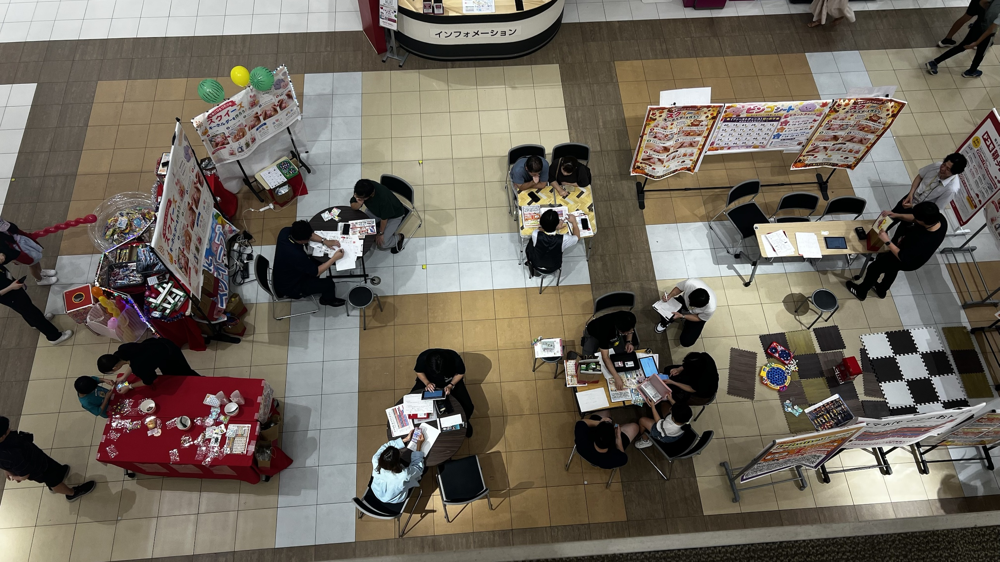
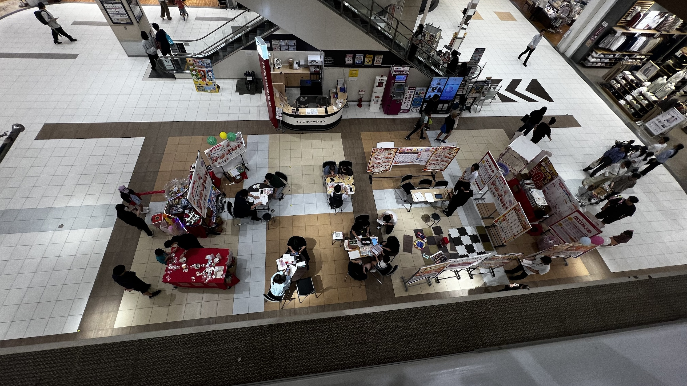

# 2026年09月 の生ログ

原文のまま、時系列、追記のみ。過去のエントリは編集しない。

---

## n-2026-09-20-01 — 2026-09-20 17:21

> ここに自由記述のノートのようなものを作って欲しい。今後このチャットに思ったこととかを貼っていってそれを記憶、整理、新しいアイデアなどに繋げていきたい。

**読み取り:** このノート自体の出発点。求めているのは保管庫ではなく「記憶 → 整理 → 発想」の流れ。
チャットに貼るという入口の軽さが条件で、整理の手間はこちら持ち。セッションをまたいで思考が
繋がることが本命で、書いたものが死蔵されないことが成否を分ける。
**タグ:** #ノート設計 #仕組み
**関連:** README.md / CLAUDE.md

---

## n-2026-09-20-02 — 2026-09-20 17:49

> 今撮った写真だけどこの写真から何を思うか考えてまとめて

**添付:**  
（ショッピングモールの吹き抜け、インフォメーション前の催事スペースを上階から撮ったもの2枚。
1枚目は催事スペースの寄り、2枚目はさらに上から通路と店舗込みの引き）

**写っているもの（事実）:**
- 「スクイーズキーホルダーを作ろう」の看板、番号入りの「ビンゴシート」パネル、風船、駄菓子/景品らしき
  小物を並べた赤いクロスの長机、ジョイントマットのキッズスペースと玩具
- 折りたたみ机が数卓。各卓で1対1〜1対2、向かい合って着席。机上は紙のカタログ・記入用紙・iPad・スマホ
- スタッフとおぼしき黒服の人が多数。空席の椅子も目立つ
- 催事は色の違う床タイルのブロック上にあり、周囲の白いタイルは通路。通行人は通路側を歩いている
- 商材が何か（保険・住宅・通信など）は写真からは判別できない

**読み取り:** 客寄せ（子ども向け体験・ビンゴ・景品）と商談（着席1対1）が、隣接しつつ空間的に
分離して配置されている。ファネルの全段階が1枚に同時に写っているのが面白い。
俯瞰にした瞬間、「楽しそうなイベント」が「転換のための装置」に見える。
**タグ:** #仕組み #空間設計 #動線 #観察
**関連:** n-2026-09-20-01（「仕組み」タグつながり。あちらは記憶の仕組み、こちらは商売の仕組み）

---

## n-2026-09-20-03 — 2026-09-20 17:55

> これは携帯会社の通信サービスに関するブースです。
> 俺にはこれが社会の縮図のようにも見えたんだけどどう思う？

**読み取り:** 商材が通信だと判明。差別化しにくい必需インフラであるほど、競争が中身から
売り場の演出に移る、という構造が効いてくる。「社会の縮図」という見立てに本人が価値を
感じている。n-2026-09-20-02 の未解決だった「なぜ低転換でも成立するか」は、通信契約の
継続収益で説明がつく（1件あたりの生涯価値が大きい）。
**タグ:** #仕組み #社会 #空間設計 #観察
**関連:** n-2026-09-20-02（同じ写真。商材の判明と、未解決の問いの一部解消）

### Claude の返し（要約）

- 縮図として一番効くのは「設計者が写っていないこと」。黒服のスタッフも構造の内側の人間で、
  ルールを作った側はフレームの外にいる
- 通信は中身で差がつかないインフラなので、競争が演出（スクイーズ・ビンゴ・風船）に全振り
  されている。景品があるのは商品に差がないから
- 反論として、縮図は比例縮小のはずだがこの空間は強く濾過されている。平日昼に
  モールに来られない人は最初から写っていない
- 撮影している上階も構造の一部。俯瞰できる位置は、免除されている気分になれる位置でもある

---

## n-2026-09-20-04 — 2026-09-20 18:23

> おれが思ったのは、搾取する人される人、結局人類は他の人間との差別化で生きていくのかと言うことと、さらにその上の階層であるその生活から抜け出し、真の自由の獲得を考えた。人類の進歩はその構造から抜け出し自分の追い求めたいものを追い続けると言う自由なのではないかとも思ったりする。それについてどう思うか。
> また、その真の意味での自由を獲得するにはどうすればいいかなどを考えてみて

**読み取り:** 写真の観察から一気に抽象に上がった。論点は3つ入っている。(1) 搾取する/される
の二分、(2) 人類は他者との差別化で生きるのか、(3) そこから抜け出す「真の自由」こそが進歩
ではないか。前回こちらが投げた「嫌な感じがしたか / よくできてると思ったか」には、
「搾取」という語の選択で実質もう答えている（嫌な感じ側）。
**タグ:** #自由 #社会 #仕組み
**関連:** n-2026-09-20-03（縮図の見立ての続き）/ ideas/自由の設計.md

### Claude の返し（要約）

- 「抜け出す」は前回指摘したバルコニー効果の一段上。脱出を目的にしている間は、
  まだ構造が人生の中心に居座っている（自由の定義が構造に寄生している）
- 差別化には2種類ある。位置財をめぐる消耗戦と、実際の異質性。前者が激しくなるのは
  本当の差がないときで、これは n-2026-09-20-03 のブース（4Gは4Gだから景品が要る）と同じ構造
- 搾取する/されるは人ではなく位置と場面につく。黒服も搾取される側。設計者は写っていない
- 進歩=自由の拡大は半分正しい（選択肢空間は確実に広がった）が、同時に
  その自由を使うための注意力を刈り取る装置も高度化した。差し引きは自明ではない
- 自由は「外に出ること」ではなく「追いたいものが先にあること」。順番が逆で、
  やりたいことを見つけてから自由になるのではなく、断れる状態を作ってから探すほうが現実的
